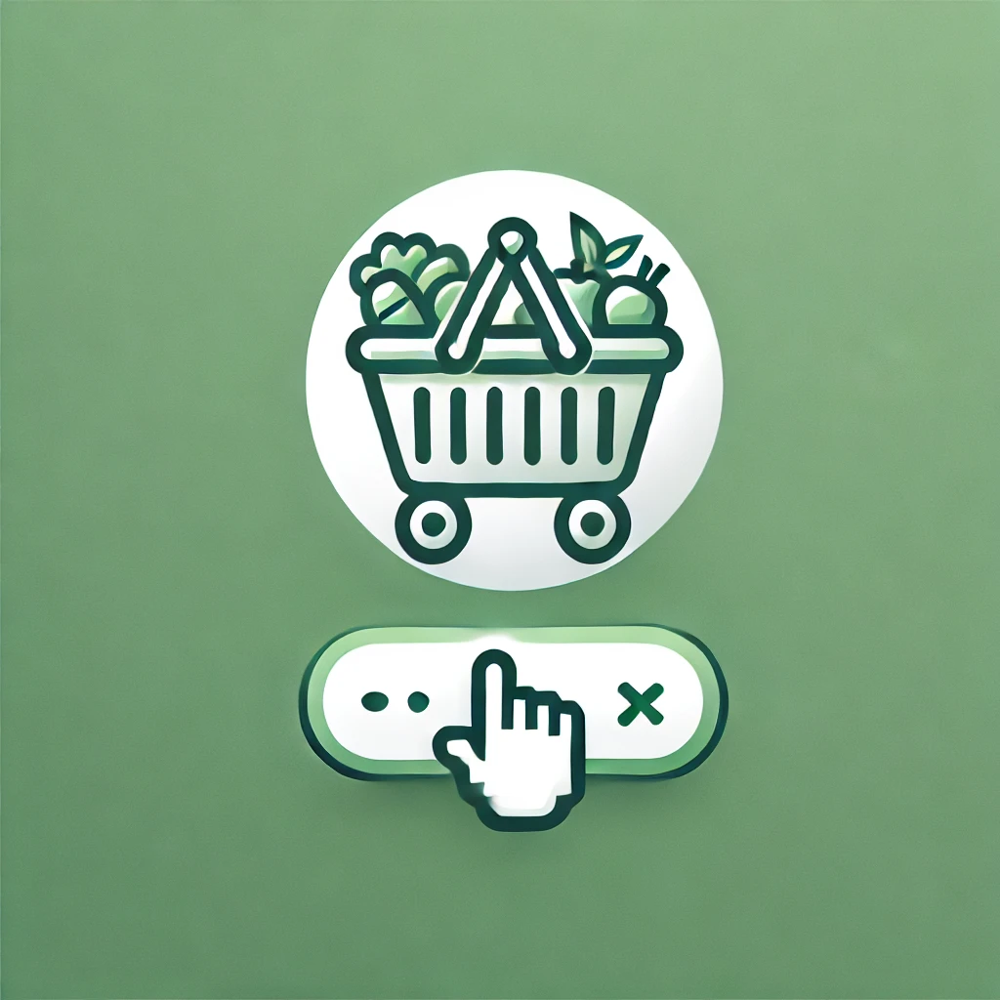

<h1 align="center">
    
     
    OpenFresh
</h1>
 
<h2 align="center">Work In Progress!</h2>

An AI agent for streamlining grocery shopping. Retrieves relevant ingredients from chosen recipe and uses reverse engineering to add ingredients to the user’s Sainsbury's groceries account for the user to check prior to ordering.

Tech Stack used:
- TypeScript
- Javascript (Node.js)
- OpenAI API
- Sainsbury's groceries API
- Selenium WebDriver API